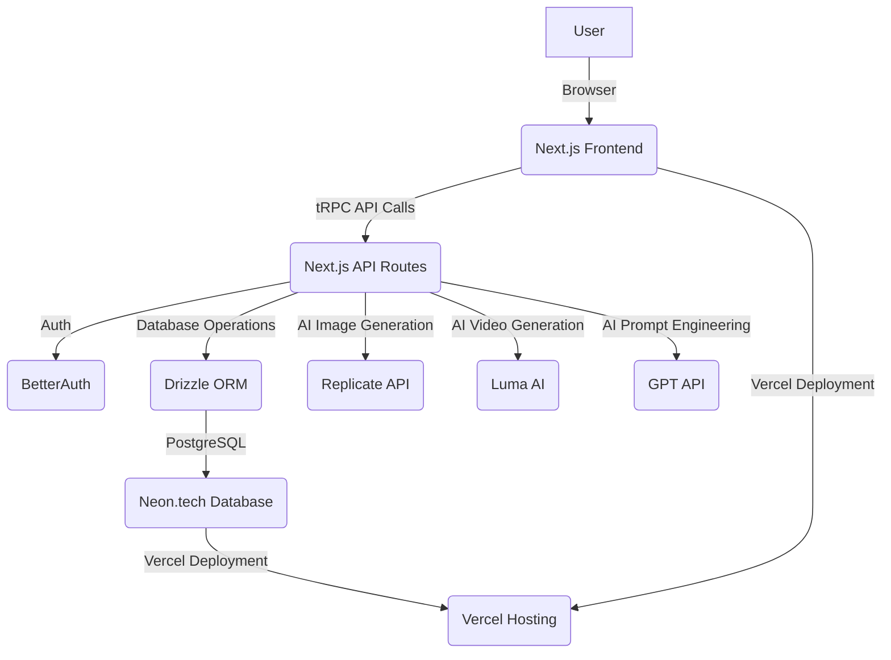
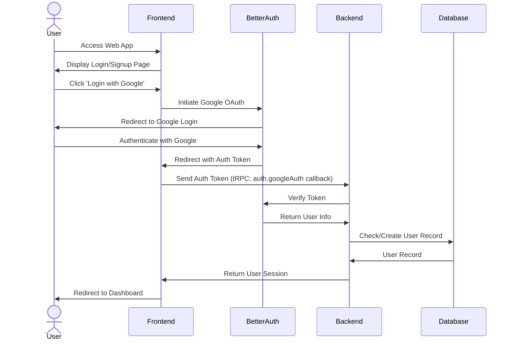
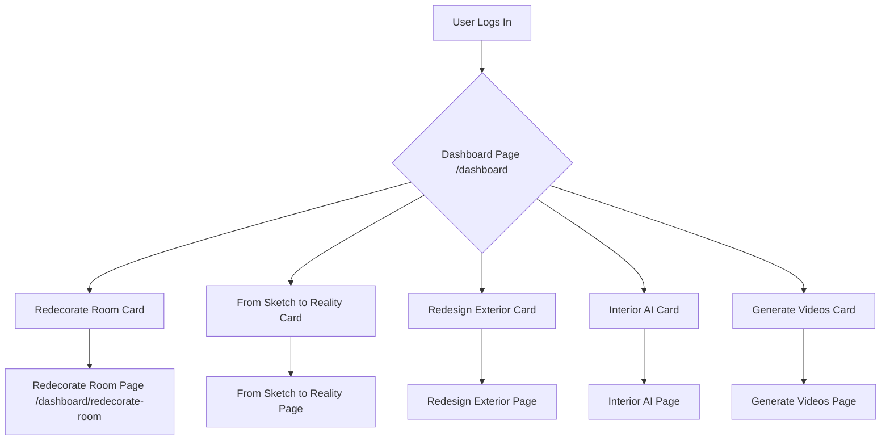
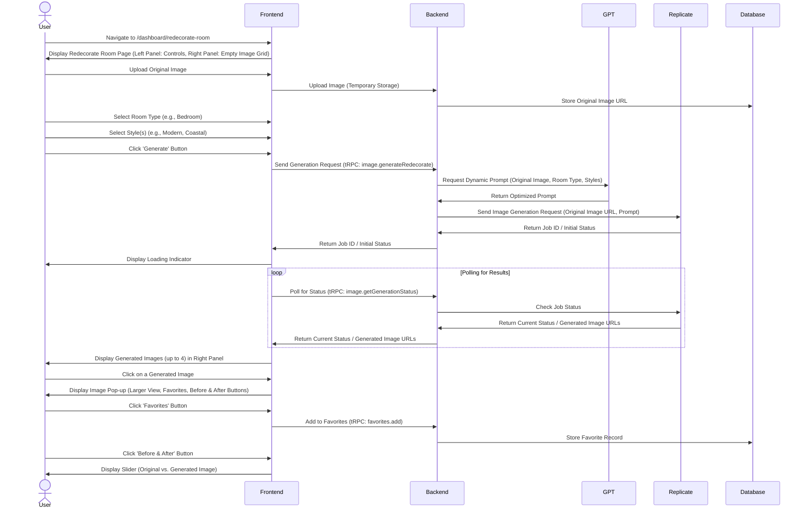

# Product Requirements Document (PRD)
## AI Interior Design Web Application

**Document Version:** 1.0  
**Date:** January 20, 2025  
**Author:** Manus AI  
**Project Codename:** InteriorAI Pro  

---

## Table of Contents

1. [Executive Summary](#executive-summary)
2. [Product Vision & Goals](#product-vision--goals)
3. [Market Analysis & User Personas](#market-analysis--user-personas)
4. [Feature Specifications](#feature-specifications)
5. [Technical Architecture](#technical-architecture)
6. [User Experience Design](#user-experience-design)
7. [Implementation Timeline](#implementation-timeline)
8. [Success Metrics](#success-metrics)
9. [Risk Assessment](#risk-assessment)
10. [Appendices](#appendices)

---


## 1. Executive Summary

This Product Requirements Document (PRD) outlines the development of 'InteriorAI Pro,' an innovative web application designed to revolutionize interior and exterior design through advanced Artificial Intelligence. The platform will empower users to redecorate rooms, transform sketches into realistic renders, redesign exteriors, and generate immersive video walkthroughs. Leveraging cutting-edge AI models from Replicate and Luma AI, combined with a robust Next.js, Shadcn, and Drizzle ORM tech stack, InteriorAI Pro aims to deliver a seamless, intuitive, and highly realistic design experience. The initial focus of this document is on the core dashboard functionalities and the detailed specifications for the 'Redecorate Room' feature, which includes dynamic image generation, style selection, and an interactive before-and-after comparison tool. The application will prioritize a superior user experience with a clean, intuitive dashboard design, aiming to surpass existing solutions like roomgpt.io in functionality and aesthetic appeal.


## 2. Product Vision & Goals

### 2.1 Product Vision

To become the leading AI-powered platform for interior and exterior design, enabling individuals and professionals to effortlessly visualize, create, and transform spaces with unparalleled realism and creative freedom. We envision a future where design barriers are eliminated, and anyone can bring their dream spaces to life with the power of artificial intelligence.

### 2.2 Product Goals

*   **Goal 1: Deliver a Superior User Experience:** Create an intuitive, visually appealing, and highly responsive web application that simplifies complex design processes. This includes a dashboard design that is superior to existing solutions like roomgpt.io.
*   **Goal 2: Achieve High-Fidelity AI Generations:** Ensure that AI-generated images and videos are of 4K quality, realistic, and accurately reflect user inputs for room type, style, and other parameters.
*   **Goal 3: Foster Creative Exploration:** Provide a diverse range of design styles and functionalities (redecorate, sketch-to-reality, exterior redesign, video creation) to encourage experimentation and cater to various user needs.
*   **Goal 4: Ensure Scalability and Performance:** Build a robust and scalable backend infrastructure capable of handling high volumes of AI generation requests and user traffic.
*   **Goal 5: Establish a Strong Technical Foundation:** Implement a modern and efficient tech stack (Next.js, Shadcn, Neon.tech, BetterAuth, Drizzle ORM, tRPC, GPT, Replicate, Luma AI, Tanstack, Vercel AI SDK) to ensure long-term maintainability and extensibility.
*   **Goal 6: Drive User Engagement:** Implement features like favorites, before-and-after sliders, and video creation to enhance user interaction and retention.


## 3. Market Analysis & User Personas

### 3.1 Market Analysis

The interior design market is a multi-billion dollar industry, with a growing demand for digital tools that simplify the design process. The rise of AI has opened new avenues for innovation, allowing for rapid visualization and iteration of design concepts. Existing solutions often lack the realism, variety, or user-friendliness that modern consumers demand. InteriorAI Pro aims to fill this gap by offering a comprehensive, high-quality, and intuitive platform.

Key market trends include:
*   **Increasing demand for DIY design solutions:** Homeowners are increasingly looking for tools to design and visualize their spaces without professional help.
*   **Growth of AI in creative industries:** AI is transforming various creative fields, and design is no exception, offering unprecedented capabilities for content generation and personalization.
*   **Importance of visual content:** High-quality visual representations are crucial for decision-making in design, driving the need for realistic renders and immersive experiences.

### 3.2 User Personas

To ensure InteriorAI Pro meets the diverse needs of its target audience, we have identified the following key user personas:

#### Persona 1: The Homeowner/DIY Enthusiast
*   **Name:** Sarah, 32
*   **Occupation:** Marketing Manager
*   **Goals:** Redecorate her living room, visualize different styles before committing to purchases, and get inspiration for home improvement projects.
*   **Pain Points:** Difficulty imagining how new furniture or colors will look in her space, overwhelmed by too many design choices, expensive professional design services.
*   **Needs:** Easy-to-use interface, realistic visualizations, variety of design styles, cost-effective solution.

#### Persona 2: The Interior Designer (Small Business/Freelancer)
*   **Name:** Mark, 45
*   **Occupation:** Freelance Interior Designer
*   **Goals:** Quickly generate design concepts for clients, present multiple options efficiently, and reduce the time spent on manual rendering.
*   **Pain Points:** Time-consuming rendering processes, difficulty conveying abstract design ideas to clients, limited tools for rapid prototyping.
*   **Needs:** Fast generation times, high-quality renders, ability to iterate quickly, diverse style options, integration with existing workflows.

#### Persona 3: The Real Estate Agent
*   **Name:** Emily, 38
*   **Occupation:** Real Estate Agent
*   **Goals:** Stage vacant properties virtually, help potential buyers visualize renovations, and enhance property listings with appealing visuals.
*   **Pain Points:** High costs of physical staging, difficulty showcasing a property's potential, lack of tools for quick virtual makeovers.
*   **Needs:** Ability to redecorate rooms quickly, realistic renders for marketing, easy sharing of generated images.


## 4. Feature Specifications

### 4.1 Dashboard Overview

The main dashboard (`/dashboard`) will serve as the central hub for users to access all the core functionalities of InteriorAI Pro. It will feature a clean, intuitive, and visually appealing design, prioritizing ease of navigation and quick access to key features. The dashboard will present different AI generation capabilities as distinct cards, each leading to a dedicated application router page.

#### 4.1.1 Dashboard Cards

The dashboard will prominently display the following feature cards:

*   **Redecorate Room:**
    *   **Description:** Allows users to redecorate existing interior spaces by applying various design styles and generating new images. This is the primary focus of the initial development phase.
    *   **Navigation:** Leads to `/dashboard/redecorate-room`.

*   **From Sketch to Reality:**
    *   **Description:** Enables users to transform hand-drawn sketches or basic layouts into realistic interior renders.
    *   **Navigation:** Leads to `/dashboard/sketch-to-reality`.

*   **Redesign Exterior:**
    *   **Description:** Provides AI rendering capabilities for exterior spaces, suitable for architectural visualization from Sketchup, Blender, 3Ds Max, and Revit models. It will leverage tools similar to mnml.ai render tools.
    *   **Navigation:** Leads to `/dashboard/redesign-exterior`.

*   **Interior AI:**
    *   **Description:** Offers AI interior design renderings to reimagine any room or interior space with over 20+ interior design styles. Users can control finishes, colors, and lights to create stunning interiors.
    *   **Navigation:** Leads to `/dashboard/interior-ai`.

*   **Generate Videos:**
    *   **Description:** Allows users to create dynamic video walkthroughs of their designed spaces, featuring zoom in, zoom out, and 180-degree rotation effects, utilizing Luma AI.
    *   **Navigation:** Leads to `/dashboard/generate-videos`.

### 4.2 Redecorate Room Feature (`/dashboard/redecorate-room`)

The Redecorate Room feature is designed to provide users with a powerful yet simple tool to visualize different design possibilities for their interior spaces. The page layout will be split into two main sections: a left-hand control panel for inputting generation parameters and a larger right-hand display area for showcasing the generated images.

#### 4.2.1 Page Layout

*   **Left Panel (Control Panel):** This section will occupy a smaller portion of the screen and contain all the input tools and controls for image generation.
*   **Right Panel (Image Display Area):** This section will take up the majority of the screen real estate, dedicated to displaying the generated images. It will be capable of showing up to four generated images simultaneously.

#### 4.2.2 Input Controls (Left Panel)

1.  **Room Type Selection:**
    *   **Component:** A `select` button or dropdown.
    *   **Options:** Bedroom, Living Room, Bathroom, Kitchen, Dining Room.
    *   **Functionality:** Users must select one room type. This selection will dynamically influence the AI generation prompt.

2.  **Style Selection (Select Room Themes):**
    *   **Component:** A section titled 


`Select Room Themes` containing 9 small cards arranged in a 3x3 grid.
    *   **Options:** Modern, Summer, Professional, Tropical, Coastal, Vintage, Industrial, Neoclassic, Tribal.
    *   **Functionality:** Users can select one or more styles. The selected styles will be incorporated into the AI generation prompt.

3.  **Generate Button:**
    *   **Component:** A prominent button labeled `Generate`.
    *   **Functionality:** Upon clicking, the system will initiate the image generation process using the selected room type, style(s), and the uploaded original image. This process will involve the Replicate API in conjunction with the Vercel AI SDK.

#### 4.2.3 Image Generation and Display (Right Panel)

Upon clicking the `Generate` button, the following sequence of events will occur:

1.  **Original Image Storage:** The user's original uploaded image will be securely stored in the database.
2.  **AI Image Generation:** The system will send the original image, selected room type, and selected style(s) to the Replicate API via the Vercel AI SDK. The AI model will generate new images based on these inputs.
3.  **Dynamic Prompt Generation:** A crucial aspect of this feature is the dynamic and intelligent generation of the AI prompt. The system will detect the chosen room type and design style(s) and construct a comprehensive prompt to ensure realistic, high-quality (4K resolution) results. The prompt will be designed to guide the AI model to produce images that are aesthetically pleasing and functionally appropriate for the selected parameters.
4.  **Progress Indicator:** A loading indicator will be displayed in the image display area while the AI generation is in progress.
5.  **Image Display Layout:** Up to four generated images will be displayed in the right panel in a specific grid layout:
    *   **First Image:** Top-left corner.
    *   **Second Image:** Top-right corner.
    *   **Third Image:** Bottom-left corner.
    *   **Fourth Image:** Bottom-right corner.

#### 4.2.4 Post-Generation Features

1.  **Image Pop-up/Detail View:**
    *   **Functionality:** Clicking on any generated image in the right panel will open a larger pop-up or a dedicated detail page, showcasing the image in full resolution.
    *   **Buttons within Pop-up:**
        *   **Favorites Button:** Allows users to mark the image as a favorite, saving it for future reference. This will likely involve storing the image ID and user ID in the database.
        *   **Before & After Slider Button:** Clicking this button will activate a React slider component. This slider will visually compare the original uploaded image with the newly generated image, allowing users to easily see the transformation.

### 4.3 Authentication

*   **Provider:** BetterAuth.
*   **Integration:** Google Provider for authentication.

### 4.4 Database & ORM

*   **Database:** Neon.tech (PostgreSQL compatible).
*   **ORM:** Drizzle ORM.
*   **Schema:** Will include tables for users, generated images (with references to original images, room type, style, and AI prompt used), and favorites.

### 4.5 API & Data Layer

*   **API Framework:** tRPC for type-safe end-to-end communication between frontend and backend.
*   **AI Integration:**
    *   **Image Generation:** Replicate API (for core image generation models) integrated via Vercel AI SDK.
    *   **Video Generation:** Luma AI (for advanced video creation features like zoom, rotate).
    *   **Text Generation/Prompt Engineering:** GPT (for dynamic and intelligent AI prompt generation based on user inputs).

### 4.6 Frontend Framework

*   **Framework:** Next.js.
*   **UI Library:** Shadcn UI for pre-built, customizable UI components.
*   **State Management/Data Fetching:** Tanstack Query (React Query) for efficient data fetching, caching, and synchronization.

### 4.7 Hosting

*   **Platform:** Vercel (for Next.js application deployment).


## 5. Technical Architecture

The technical architecture of InteriorAI Pro is designed for scalability, performance, and maintainability, leveraging a modern and robust stack. The application will follow a full-stack approach, with Next.js handling the frontend, tRPC for API communication, and a serverless backend interacting with various AI services and a PostgreSQL database.

### 5.1 High-Level Architecture Diagram



### 5.2 Technology Stack Breakdown

*   **Frontend:**
    *   **Framework:** Next.js (React Framework for production)
    *   **UI Library:** Shadcn UI (reusable components built with Radix UI and Tailwind CSS)
    *   **State Management/Data Fetching:** Tanstack Query (React Query) for efficient server state management and data synchronization.
    *   **Styling:** Tailwind CSS for utility-first CSS.

*   **Backend (Next.js API Routes / Serverless Functions):**
    *   **API Layer:** tRPC for end-to-end type-safe APIs, enabling seamless communication between frontend and backend.
    *   **Authentication:** BetterAuth with Google Provider for secure user authentication.
    *   **ORM:** Drizzle ORM for type-safe and performant database interactions.
    *   **AI SDK:** Vercel AI SDK for streamlined integration with AI models.

*   **Database:**
    *   **Provider:** Neon.tech (Serverless PostgreSQL).
    *   **Purpose:** Store user data, generated image metadata (including original image URLs, generated image URLs, room type, style, AI prompt used), favorite images, and other application-specific data.

*   **AI Services Integration:**
    *   **Image Generation:** Replicate API will be used to access various open-source and proprietary AI models for image generation. This allows for flexibility in choosing the best models for specific tasks (e.g., stable diffusion models for interior design).
    *   **Video Generation:** Luma AI will be integrated for advanced video creation capabilities, including camera movements (zoom in/out, rotation) to create immersive walkthroughs of generated designs.
    *   **Prompt Engineering:** GPT (OpenAI API) will be utilized for dynamic and intelligent prompt generation. Based on user selections (room type, style), GPT will craft highly specific and effective prompts for the image and video generation AI models to ensure high-quality, realistic 4K outputs.

*   **Hosting & Deployment:**
    *   **Platform:** Vercel for seamless deployment of Next.js applications, providing serverless functions for API routes and global CDN for static assets.

### 5.3 Data Flow for Image Generation (Redecorate Room)

1.  **User Interaction:** User selects room type, style(s), and uploads an original image on the `/dashboard/redecorate-room` page.
2.  **Frontend Request:** The Next.js frontend sends a tRPC request to a Next.js API route (e.g., `/api/generate-image`). This request includes the uploaded image (or a reference to it if already stored), room type, and selected styles.
3.  **Image Upload & Storage:** The API route first handles the upload of the original image to a cloud storage solution (e.g., Vercel Blob, AWS S3, or similar, depending on final architecture decision) and stores its URL in the Neon.tech database via Drizzle ORM.
4.  **Dynamic Prompt Generation:** The API route then calls the GPT API with the selected room type and style(s) to generate a highly optimized and detailed prompt for the image generation model. This prompt will emphasize 4K resolution and realism.
5.  **Replicate API Call:** The API route sends a request to the Replicate API, passing the original image URL, the dynamically generated prompt, and any other necessary parameters (e.g., model ID, aspect ratio).
6.  **AI Processing:** Replicate processes the request using the specified AI model.
7.  **Image Retrieval & Storage:** Once the AI model generates the new image(s), Replicate returns the URLs of the generated images. The API route then stores these URLs, along with the original image URL, room type, style, and the generated prompt, in the Neon.tech database.
8.  **Frontend Response:** The API route sends the URLs of the generated images back to the Next.js frontend.
9.  **Image Display:** The frontend displays the generated images in the designated right panel.

### 5.4 Database Schema (Conceptual)

#### `users` table
*   `id` (UUID, Primary Key)
*   `email` (VARCHAR, Unique)
*   `name` (VARCHAR)
*   `auth_provider` (VARCHAR) - e.g., 'google'
*   `created_at` (TIMESTAMP)
*   `updated_at` (TIMESTAMP)

#### `images` table
*   `id` (UUID, Primary Key)
*   `user_id` (UUID, Foreign Key to `users.id`)
*   `original_image_url` (VARCHAR) - URL of the user's uploaded image
*   `generated_image_url` (VARCHAR) - URL of the AI-generated image
*   `room_type` (VARCHAR) - e.g., 'bedroom', 'livingroom'
*   `style` (VARCHAR) - e.g., 'modern', 'industrial'
*   `ai_prompt_used` (TEXT) - The exact prompt sent to the AI model
*   `resolution` (VARCHAR) - e.g., '4K'
*   `created_at` (TIMESTAMP)

#### `favorites` table
*   `id` (UUID, Primary Key)
*   `user_id` (UUID, Foreign Key to `users.id`)
*   `image_id` (UUID, Foreign Key to `images.id`)
*   `created_at` (TIMESTAMP)

This schema provides a foundation for storing user data, tracking generated images, and managing user favorites. Further tables may be added for features like video generation metadata, project management, or subscription plans as the application evolves.


### 5.5 API Specifications (tRPC)

The API layer will be built using tRPC, providing a fully type-safe API experience from backend to frontend. This eliminates the need for manual API schema generation and ensures that frontend and backend remain synchronized. Below are conceptual API endpoints for key functionalities:

#### 5.5.1 Authentication Endpoints

*   **`auth.googleAuth`:** Initiates Google OAuth flow.
    *   **Input:** None.
    *   **Output:** Redirects to Google authentication page.
*   **`auth.getSession`:** Retrieves current user session.
    *   **Input:** None.
    *   **Output:** `UserSession` object (if authenticated) or `null`.
*   **`auth.signOut`:** Logs out the current user.
    *   **Input:** None.
    *   **Output:** Success message.

#### 5.5.2 Image Generation Endpoints

*   **`image.generateRedecorate`:** Triggers the redecoration image generation process.
    *   **Input:**
        ```typescript
        interface GenerateRedecorateInput {
            originalImageUrl: string; // URL of the uploaded original image
            roomType: 'bedroom' | 'livingroom' | 'bathroom' | 'kitchen' | 'diningroom';
            styles: ('modern' | 'summer' | 'professional' | 'tropical' | 'coastal' | 'vintage' | 'industrial' | 'neoclassic' | 'tribal')[];
        }
        ```
    *   **Output:**
        ```typescript
        interface GenerateRedecorateOutput {
            jobId: string; // ID to track the generation job status
            generatedImageUrls: string[]; // URLs of the generated images (up to 4)
        }
        ```
*   **`image.getGenerationStatus`:** Checks the status of an image generation job.
    *   **Input:**
        ```typescript
        interface GetGenerationStatusInput {
            jobId: string;
        }
        ```
    *   **Output:**
        ```typescript
        interface GetGenerationStatusOutput {
            status: 'pending' | 'in_progress' | 'completed' | 'failed';
            progress?: number; // 0-100
            generatedImageUrls?: string[];
            error?: string;
        }
        ```

#### 5.5.3 User & Favorites Endpoints

*   **`user.getProfile`:** Retrieves the current user's profile.
    *   **Input:** None.
    *   **Output:** `UserProfile` object.
*   **`favorites.add`:** Adds an image to user's favorites.
    *   **Input:**
        ```typescript
        interface AddFavoriteInput {
            imageId: string;
        }
        ```
    *   **Output:** Success message.
*   **`favorites.remove`:** Removes an image from user's favorites.
    *   **Input:**
        ```typescript
        interface RemoveFavoriteInput {
            imageId: string;
        }
        ```
    *   **Output:** Success message.
*   **`favorites.getAll`:** Retrieves all favorited images for the current user.
    *   **Input:** None.
    *   **Output:** `Image[]` array.

### 5.6 Integration Requirements

#### 5.6.1 Replicate API Integration

*   **Purpose:** Core AI image generation.
*   **Key Considerations:**
    *   **Model Selection:** Research and select appropriate Stable Diffusion or other generative models on Replicate that are best suited for interior design redecoration, sketch-to-reality, and exterior rendering. Models capable of high-resolution (4K) output and style transfer will be prioritized.
    *   **API Key Management:** Securely manage Replicate API keys.
    *   **Rate Limiting & Error Handling:** Implement robust error handling and retry mechanisms for API calls, considering Replicate's rate limits and potential network issues.
    *   **Asynchronous Processing:** Image generation can be time-consuming. Implement a webhook or polling mechanism to get the results asynchronously from Replicate.
    *   **Cost Optimization:** Monitor API usage and explore strategies for cost optimization, such as choosing efficient models or optimizing prompt length.

#### 5.6.2 Luma AI Integration

*   **Purpose:** Advanced video generation (zoom, rotate, 180% view).
*   **Key Considerations:**
    *   **API Access:** Understand Luma AI's API capabilities for video generation, specifically focusing on camera movements and scene manipulation.
    *   **Input Requirements:** Determine the optimal input format for Luma AI (e.g., sequence of images, 3D model data, or specific prompts).
    *   **Output Format:** Ensure generated videos are in a widely compatible format (e.g., MP4).
    *   **Processing Time:** Video generation is resource-intensive. Implement appropriate loading states and notifications for users.
    *   **User Subscription Requirement:** As per user profile, video generation will require an upgraded subscription. This needs to be handled gracefully in the UI and backend, prompting users to upgrade if they attempt to use this feature without the necessary subscription.

#### 5.6.3 GPT (OpenAI API) Integration

*   **Purpose:** Dynamic and intelligent AI prompt engineering.
*   **Key Considerations:**
    *   **Prompt Template Design:** Develop effective prompt templates that combine user selections (room type, style) with instructions for the image generation models (e.g., 


`"a photorealistic 4K image of a modern bedroom with natural light"`).
    *   **Contextual Understanding:** GPT will analyze the selected room type and style to generate prompts that are contextually relevant and lead to optimal AI model performance.
    *   **Prompt Optimization:** Continuously refine prompt generation logic based on the quality of generated images to ensure the best possible output from Replicate and Luma AI.

#### 5.6.4 Vercel AI SDK Integration

*   **Purpose:** Simplify integration with AI models, particularly for streaming responses and handling various AI providers.
*   **Key Considerations:**
    *   **Abstraction Layer:** The SDK provides a convenient abstraction layer over direct API calls to AI models, making it easier to swap or integrate new models in the future.
    *   **Streaming:** Leverage the SDK for streaming responses from AI models, which can improve perceived performance for users during image or video generation.

#### 5.6.5 BetterAuth Integration

*   **Purpose:** Secure and flexible user authentication.
*   **Key Considerations:**
    *   **Google Provider:** Implement Google as the primary authentication provider, simplifying the login process for users.
    *   **Session Management:** Ensure secure session management and token handling.
    *   **User Data Synchronization:** Synchronize user data (email, name) from BetterAuth with the application's `users` table in Neon.tech.

#### 5.6.6 Neon.tech Integration

*   **Purpose:** Scalable and serverless PostgreSQL database.
*   **Key Considerations:**
    *   **Connection Management:** Efficiently manage database connections, especially in a serverless environment.
    *   **Schema Migrations:** Use Drizzle ORM's migration capabilities to manage database schema changes.
    *   **Backup and Recovery:** Implement a strategy for database backups and disaster recovery.

#### 5.6.7 tRPC Integration

*   **Purpose:** Type-safe API layer.
*   **Key Considerations:**
    *   **Router Definition:** Define clear and modular tRPC routers for different functionalities (e.g., `authRouter`, `imageRouter`, `userRouter`, `favoritesRouter`).
    *   **Error Handling:** Implement centralized error handling for tRPC procedures.
    *   **Client-Side Integration:** Ensure seamless integration with Tanstack Query on the frontend for data fetching and mutations.

#### 5.6.8 Shadcn UI Integration

*   **Purpose:** Consistent and customizable UI components.
*   **Key Considerations:**
    *   **Component Usage:** Utilize Shadcn UI components for building the dashboard, forms, and other UI elements to ensure a consistent look and feel.
    *   **Customization:** Customize components to match the desired aesthetic and branding of InteriorAI Pro.
    *   **Responsiveness:** Ensure all components are responsive and adapt well to different screen sizes.

#### 5.6.9 Tanstack Query Integration

*   **Purpose:** Efficient data fetching, caching, and synchronization.
*   **Key Considerations:**
    *   **Query Management:** Use Tanstack Query for managing all asynchronous data operations (e.g., fetching user data, image generation status, favorites).
    *   **Caching:** Leverage Tanstack Query's caching mechanisms to improve application performance and reduce unnecessary API calls.
    *   **Error Handling & Loading States:** Implement appropriate loading states and error handling for data fetching operations.

This concludes the detailed technical architecture and integration requirements. The next step is to focus on the user experience design, including user flows and wireframe descriptions.


## 6. User Experience Design

This section details the user experience (UX) design for InteriorAI Pro, focusing on the primary user flows and conceptual wireframe descriptions for the dashboard and the "Redecorate Room" feature. The design philosophy emphasizes intuitiveness, visual appeal, and efficiency to provide a seamless and enjoyable user journey.

### 6.1 User Flows

#### 6.1.1 Authentication Flow



#### 6.1.2 Dashboard Navigation Flow



#### 6.1.3 Redecorate Room Feature Flow



### 6.2 Wireframe Descriptions (Conceptual)

#### 6.2.1 Dashboard Wireframe

*   **Layout:** A responsive grid layout that adapts to different screen sizes. The primary content area will be dominated by the feature cards.
*   **Header:**
    *   Logo (Top-left)
    *   User Profile/Avatar (Top-right, with dropdown for settings, logout)
    *   Navigation links (e.g., Home, My Designs, Favorites - optional, could be in sidebar)
*   **Main Content Area:**
    *   **Title:** 


`Welcome, [User Name]!` or `Choose Your Design Journey`.
    *   **Feature Cards:** Large, visually appealing cards for each main feature (Redecorate Room, From Sketch to Reality, Redesign Exterior, Interior AI, Generate Videos). Each card will have an icon, title, and a brief description. They will be clickable to navigate to the respective feature pages.
*   **Footer:** Copyright information, links to privacy policy, terms of service.

#### 6.2.2 Redecorate Room Page Wireframe

*   **Layout:** Two-column layout. Left column (smaller width) for controls, right column (larger width) for image display.
*   **Header:** Similar to dashboard header, possibly with a back button to return to the dashboard.
*   **Left Panel (Controls):**
    *   **Section Title:** `Generate New Design`.
    *   **Image Upload Area:** A clear drag-and-drop area or a button to upload the original room image. Visual feedback (thumbnail of uploaded image) will be provided.
    *   **Room Type Selector:** A `select` dropdown or a set of radio buttons for `Room Type` (Bedroom, Living Room, Bathroom, Kitchen, Dining Room).
    *   **Style Selector:** A section titled `Select Room Themes` with a 3x3 grid of small, clickable cards. Each card will represent a style (Modern, Summer, Professional, Tropical, Coastal, Vintage, Industrial, Neoclassic, Tribal) with a small icon or image representing the style.
    *   **Generate Button:** A prominent, centrally located button to initiate the generation process. It will be disabled until all necessary inputs (image, room type, style) are provided.
*   **Right Panel (Image Display):**
    *   **Initial State:** Placeholder text or an empty state illustration indicating where generated images will appear.
    *   **Loading State:** During generation, a loading spinner or progress bar will be displayed, possibly with a message like `Generating your dream room...`.
    *   **Generated Images Grid:** Once generated, up to four images will be displayed in a 2x2 grid. Each image will be a clickable thumbnail.
    *   **Image Click Behavior:** Clicking a thumbnail opens a full-screen modal or a new page.
        *   **Modal/Page Content:** The generated image displayed prominently.
        *   **Action Buttons:**
            *   `Add to Favorites` button (e.g., a heart icon).
            *   `Before & After` button: Clicking this toggles a slider component that overlays the original image and the generated image, allowing the user to slide between them to compare.
            *   `Download` button.
            *   `Close` button for the modal.

### 6.3 UI/UX Specifications

#### 6.3.1 General Design Principles

*   **Clean and Modern:** Utilize a minimalist design approach with ample whitespace to ensure clarity and focus on content.
*   **Intuitive Navigation:** Ensure that users can easily understand where they are, where they can go, and how to perform actions.
*   **Responsiveness:** The application must be fully responsive, providing an optimal experience across desktop, tablet, and mobile devices.
*   **Visual Hierarchy:** Use size, color, and placement to guide the user's eye to important elements and actions.
*   **Feedback and Affordance:** Provide clear visual feedback for user interactions (e.g., button states, loading indicators) and ensure UI elements clearly communicate their functionality.

#### 6.3.2 Color Palette

*   **Primary Colors:** (To be defined, e.g., a calming blue or green for accents, neutral grays for backgrounds and text).
*   **Accent Colors:** (To be defined, for interactive elements and highlights).
*   **Typography:** (To be defined, e.g., a clean sans-serif font for body text, a more expressive font for headings).

#### 6.3.3 Component Usage (Shadcn UI)

*   **Buttons:** Standardized button styles for primary actions (Generate), secondary actions (Add to Favorites), and tertiary actions.
*   **Select/Dropdowns:** Consistent styling for room type selection.
*   **Cards:** Used extensively for dashboard features and style selection, with hover effects and clear selection indicators.
*   **Modals/Dialogs:** For image detail view and other pop-up interactions.
*   **Sliders:** For the before-and-after comparison.
*   **Loading Indicators:** Spinners or progress bars for AI generation processes.

#### 6.3.4 Accessibility Considerations

*   **Keyboard Navigation:** Ensure all interactive elements are navigable via keyboard.
*   **ARIA Attributes:** Use appropriate ARIA attributes for screen readers.
*   **Color Contrast:** Maintain sufficient color contrast for readability.
*   **Focus Management:** Proper focus management for modals and interactive elements.

This detailed UX section provides a clear vision for the user interface and interaction patterns, ensuring a user-centric design for InteriorAI Pro.


## 7. Implementation Timeline

This timeline provides a high-level overview of the proposed phases for the development and deployment of InteriorAI Pro, with a primary focus on the dashboard and the "Redecorate Room" feature. This is a preliminary timeline and may be adjusted based on resource availability, unforeseen challenges, and detailed sprint planning.

### Phase 1: Planning & Setup (2-3 Weeks)
*   **Week 1:** Finalize PRD, set up project repositories, configure CI/CD pipelines, establish communication channels.
*   **Week 2:** Initial Next.js project setup, Drizzle ORM configuration, database provisioning (Neon.tech), BetterAuth integration (Google Provider).
*   **Week 3:** Basic tRPC API setup, initial UI component library integration (Shadcn UI).

### Phase 2: Core Feature Development - Dashboard & Redecorate Room (6-8 Weeks)
*   **Weeks 4-5:** Develop Dashboard UI with feature cards, implement navigation to feature pages.
*   **Weeks 6-7:** Develop "Redecorate Room" page layout (left panel controls, right panel image display).
*   **Weeks 8-9:** Implement image upload functionality, room type and style selection UI.
*   **Weeks 10-11:** Integrate Replicate API for image generation, implement dynamic prompt generation using GPT API, display generated images.
*   **Weeks 12-13:** Develop image pop-up/detail view, "Add to Favorites" functionality, and "Before & After" slider.

### Phase 3: Testing & Refinement (2-3 Weeks)
*   **Week 14:** Unit testing, integration testing, and end-to-end testing for core features.
*   **Week 15:** Bug fixing, performance optimization, UI/UX refinements based on internal feedback.
*   **Week 16:** User Acceptance Testing (UAT) with a small group of beta testers.

### Phase 4: Deployment & Post-Launch (Ongoing)
*   **Week 17:** Initial deployment to Vercel, monitoring and hotfixes.
*   **Post-Launch:** Continuous monitoring, user feedback collection, iterative improvements, and planning for subsequent features (Sketch to Reality, Exterior Redesign, Video Generation).

**Note:** Development of other features (From Sketch to Reality, Redesign Exterior, Interior AI, Generate Videos) will be phased in subsequent iterations, with video generation being dependent on user subscription upgrades.


## 8. Success Metrics

To evaluate the success of InteriorAI Pro, particularly the initial launch focusing on the dashboard and the "Redecorate Room" feature, the following key performance indicators (KPIs) will be monitored:

*   **User Acquisition:**
    *   **Metric:** Number of new user sign-ups per week/month.
    *   **Target:** Achieve X new users within the first month post-launch.
*   **User Engagement:**
    *   **Metric:** Daily Active Users (DAU) / Monthly Active Users (MAU).
    *   **Metric:** Average session duration.
    *   **Metric:** Number of images generated per user session.
    *   **Metric:** Percentage of users utilizing the "Before & After" slider.
    *   **Metric:** Number of images added to favorites.
    *   **Target:** Maintain a DAU/MAU ratio of X%, average session duration of Y minutes, Z images generated per session, A% slider usage, B favorites per user.
*   **Feature Adoption:**
    *   **Metric:** Percentage of active users utilizing the "Redecorate Room" feature.
    *   **Target:** X% of active users engage with the redecorate feature.
*   **Image Quality & Realism:**
    *   **Metric:** User satisfaction ratings for generated images (e.g., via in-app feedback or surveys).
    *   **Metric:** Reduction in user-reported issues related to image quality or realism.
    *   **Target:** Achieve an average satisfaction score of X/5, reduce quality-related tickets by Y%.
*   **Performance:**
    *   **Metric:** Average image generation time.
    *   **Metric:** Page load times for dashboard and redecorate room pages.
    *   **Target:** Image generation time under X seconds, page load times under Y seconds.
*   **Retention:**
    *   **Metric:** User retention rate (e.g., percentage of users returning after 7 days, 30 days).
    *   **Target:** Achieve X% 7-day retention and Y% 30-day retention.
*   **Monetization (Future):**
    *   **Metric:** Conversion rate from free to paid subscriptions (for video generation and other premium features).
    *   **Target:** Achieve X% conversion rate.

These metrics will provide a comprehensive view of the product's performance and guide future development efforts.


## 9. Risk Assessment

This section identifies potential risks associated with the development and deployment of InteriorAI Pro, along with proposed mitigation strategies. Proactive risk management is crucial for ensuring project success.

### 9.1 Technical Risks

*   **Risk:** AI model performance and quality (e.g., generated images not meeting 4K realism, stylistic inconsistencies).
    *   **Mitigation:** Continuous evaluation and fine-tuning of AI models (Replicate). Implement robust prompt engineering strategies using GPT. Incorporate user feedback loops for model improvement.
*   **Risk:** Scalability of AI services (Replicate, Luma AI) under high user load.
    *   **Mitigation:** Monitor API usage and performance metrics. Implement caching mechanisms where feasible. Explore alternative AI providers or custom model deployment if scalability becomes a bottleneck. Optimize image processing pipelines.
*   **Risk:** Integration complexities with multiple third-party APIs (Replicate, Luma AI, BetterAuth, Neon.tech).
    *   **Mitigation:** Thorough API documentation review. Develop clear API contracts. Implement comprehensive integration testing. Utilize tRPC for type-safe API interactions to reduce integration errors.
*   **Risk:** Database performance issues with growing data volume.
    *   **Mitigation:** Optimize database queries and indexing. Leverage Neon.tech's serverless scaling capabilities. Implement data archiving strategies for older, less frequently accessed data.
*   **Risk:** Security vulnerabilities (e.g., data breaches, unauthorized access).
    *   **Mitigation:** Adhere to security best practices (e.g., secure coding, input validation, encryption). Regular security audits and penetration testing. Utilize BetterAuth for robust authentication.

### 9.2 Project Management Risks

*   **Risk:** Scope creep leading to delays and budget overruns.
    *   **Mitigation:** Maintain strict adherence to the PRD. Implement agile development methodologies with clear sprint goals. Prioritize features and manage expectations with stakeholders.
*   **Risk:** Resource constraints (e.g., insufficient development team, lack of specialized AI expertise).
    *   **Mitigation:** Conduct thorough resource planning. Consider external consultants or contractors for specialized tasks. Invest in team training and skill development.
*   **Risk:** Unrealistic timelines.
    *   **Mitigation:** Base timelines on realistic estimates and historical data. Incorporate buffer time for unforeseen issues. Regularly review and adjust the project schedule.

### 9.3 Market & User Risks

*   **Risk:** Low user adoption or engagement.
    *   **Mitigation:** Conduct user research and usability testing. Continuously gather user feedback and iterate on features. Implement effective marketing and user onboarding strategies.
*   **Risk:** Competition from existing or new AI design tools.
    *   **Mitigation:** Continuously innovate and differentiate the product. Focus on delivering superior quality and unique features (e.g., advanced video generation, better dashboard UX). Monitor competitor activities.
*   **Risk:** User dissatisfaction with generated results.
    *   **Mitigation:** Implement clear expectations for AI capabilities. Provide options for users to refine results. Offer diverse styles and customization options. Improve AI prompt engineering.

### 9.4 Legal & Ethical Risks

*   **Risk:** Copyright and intellectual property issues related to AI-generated content.
    *   **Mitigation:** Research and adhere to current legal guidelines regarding AI-generated content. Implement clear terms of service regarding ownership and usage. Consider using models trained on commercially licensed data.
*   **Risk:** Data privacy and compliance (e.g., GDPR, CCPA).
    *   **Mitigation:** Implement robust data privacy policies. Ensure compliance with relevant data protection regulations. Securely handle user data and image uploads.

By identifying these risks early and developing mitigation strategies, the project team can proactively address potential challenges and increase the likelihood of a successful launch for InteriorAI Pro.


## 10. Appendices

### 10.1 References

[1] Replicate. *AI Models for Image Generation*. [https://replicate.com/](https://replicate.com/)
[2] Luma AI. *Text to Video*. [https://lumalabs.ai/](https://lumalabs.ai/)
[3] Next.js. *The React Framework for the Web*. [https://nextjs.org/](https://nextjs.org/)
[4] Shadcn UI. *Beautifully designed components that you can copy and paste into your apps*. [https://ui.shadcn.com/](https://ui.shadcn.com/)
[5] Neon.tech. *The Serverless Postgres*. [https://neon.tech/](https://neon.tech/)
[6] Drizzle ORM. *TypeScript ORM for SQL databases*. [https://orm.drizzle.team/](https://orm.drizzle.team/)
[7] tRPC. *End-to-end typesafe APIs made easy*. [https://trpc.io/](https://trpc.io/)
[8] Vercel AI SDK. *Build AI-powered applications with React, Svelte, Vue, and more*. [https://sdk.vercel.ai/](https://sdk.vercel.ai/)
[9] Tanstack Query. *Powerful asynchronous state management for TS/JS, React, Solid, Vue, Svelte, and Angular*. [https://tanstack.com/query/latest](https://tanstack.com/query/latest)
[10] BetterAuth. *Your authentication solution*. (Placeholder, as a specific URL was not provided)
[11] OpenAI. *GPT Models*. [https://openai.com/](https://openai.com/)
[12] roomgpt.io. *Redecorate your room with AI*. [https://roomgpt.io/](https://roomgpt.io/)
[13] mnml.ai. *AI render for Sketchup, Blender, 3Ds Max and revit models*. [https://mnml.ai/](https://mnml.ai/)


